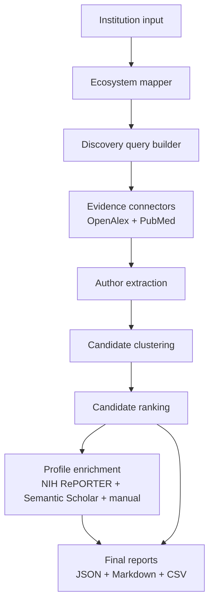

# Postdoc Scout Agent

Evidence-based research intelligence for finding and auditing potential postdoctoral supervisors in translational digital medicine and clinical AI.

[](https://github.com/auccy/postdoc-scout-agent/actions/workflows/ci.yml)
[](https://www.python.org/)
[](https://docs.astral.sh/ruff/)
[](LICENSE)

Postdoc Scout Agent is an open-source MVP for identifying, auditing, and ranking potential postdoctoral supervisors whose work is close to patient-facing biomedical applications. It emphasizes clinically meaningful, data-rich, translational profiles over pure methods, standalone algorithm development, or foundation-model architecture work.

The project currently supports an end-to-end deterministic pipeline:

1. `map-institution`
2. `build-queries`
3. `collect-evidence`
4. `extract-candidates`
5. `rank-candidates`
6. `enrich-candidates`
7. `run-pipeline`

## Why This Exists

Postdoctoral supervisor discovery is usually fragmented across medical schools, hospitals, cancer centers, public health programs, research institutes, publication databases, grant databases, and lab pages. Search results are often noisy: prestigious but method-heavy profiles can outrank clinically translational researchers who are a better fit for digital medicine, EHR/RWD, disease progression modeling, patient stratification, or clinical decision support.

This project turns that process into an auditable workflow. It maps an institution ecosystem, builds source-specific queries, collects publication evidence, extracts author clusters, ranks candidates with transparent criteria, and optionally adds profile/funding evidence.

## Who It Is For

This repository is for researchers, trainees, and research software builders exploring postdoctoral supervisor fits in:

- translational digital medicine
- clinical AI and biomedical informatics
- AD/ADRD, aging, neurodegeneration, and cognitive decline
- oncology digital medicine and trial enrichment
- EHR-based prediction and real-world data
- clinical decision support and implementation-facing AI
- patient stratification, risk prediction, and progression modeling
- public health and cohort-based biomedical AI

It is not optimized for searches focused mainly on pure biostatistics theory, standalone statistical methodology, benchmark-only ML, or foundation model architecture roles.

## Key Features

- Curated U.S. institution seed map with universities, academic medical centers, cancer centers, pediatric hospitals, health systems, and independent institutes.
- Auditable ecosystem mapping from a parent institution to relevant research units.
- Deterministic query builder for PubMed, OpenAlex, Semantic Scholar, NIH RePORTER, and web/lab-page next steps.
- OpenAlex and PubMed evidence collection with deduplication and connector warnings.
- Conservative author extraction and candidate clustering from publication metadata.
- Evidence-based ranking with transparent score dimensions and method-heavy penalty handling.
- Optional enrichment from NIH RePORTER, Semantic Scholar, and manual placeholder signals.
- End-to-end `run-pipeline` command with dry-run, resume, skip, limit, and year-bound options.
- JSON, Markdown, and CSV reports suitable for human review.

## Architecture



More detail:

- [Architecture](docs/architecture.md)
- [Pipeline](docs/pipeline.md)
- [Scoring Framework](docs/scoring_framework.md)
- [Seed Map](docs/seed_map.md)
- [Limitations](docs/limitations.md)
- [Roadmap](docs/roadmap.md)

## Installation

```bash
pip install -e ".[dev]"
```

Python 3.10+ is recommended. No real API keys are required for tests or dry runs.

Optional environment variables for live connector use:

```bash
POSTDOC_SCOUT_CONTACT_EMAIL="you@example.org"
NCBI_API_KEY="optional_ncbi_key"
```

## Quickstart

Run the placeholder scout command:

```bash
postdoc-scout scout --institution "Harvard Medical School" --mode broad --limit 20
```

Validate the curated U.S. seed map:

```bash
postdoc-scout validate-seed-map --country us --output-dir outputs
```

Create an auditable ecosystem map:

```bash
postdoc-scout map-institution --institution "Harvard University" --mode broad --country us --output-dir outputs
```

Build discovery queries:

```bash
postdoc-scout build-queries --institution "Harvard University" --mode broad --country us --output-dir outputs
```

Score deterministic mock candidates:

```bash
postdoc-scout score-mock-candidates --input examples/mock_candidates.yml --output-dir outputs/mock_scoring
```

## Dry-Run Example

Dry run maps the institution and builds queries without calling external APIs:

```bash
postdoc-scout run-pipeline --institution "Harvard University" --mode broad --country us --dry-run --output-dir outputs/harvard_dry_run
```

Expected dry-run artifacts include:

```text
outputs/harvard_dry_run/ecosystem.json
outputs/harvard_dry_run/ecosystem.md
outputs/harvard_dry_run/discovery_queries.json
outputs/harvard_dry_run/discovery_queries.md
outputs/harvard_dry_run/pipeline_run.json
outputs/harvard_dry_run/pipeline_summary.md
```

## Full-Pipeline Example

```bash
postdoc-scout run-pipeline --institution "Harvard University" --mode broad --country us --output-dir outputs/harvard --limit-queries 20 --limit-per-source 5 --top-n 20
```

Canonical pipeline outputs:

```text
ecosystem.json / ecosystem.md
discovery_queries.json / discovery_queries.md
evidence_collection.json / evidence_collection.md
candidate_extraction.json / candidate_extraction.md / candidate_extraction.csv
ranked_supervisors.json / ranked_supervisors.md / ranked_supervisors.csv
enriched_supervisors.json / enriched_supervisors.md / enriched_supervisors.csv
pipeline_run.json / pipeline_summary.md
```

## Broad vs Narrow Mode

Use `--mode broad` for translational digital medicine discovery across clinical AI, EHR/RWD, oncology, public health, clinical decision support, patient stratification, trial enrichment, and biomedical informatics.

Use `--mode narrow` for AD/ADRD, aging, neurodegeneration, neurology, memory centers, cognitive decline, and related biomarker or progression-modeling work.

The mode changes which ecosystem units, relevance domains, and query templates receive priority. It does not change the ethical requirement for human verification.

## U.S. Curated Seed Map

The U.S. seed map is a conservative research ecosystem map, not a legal affiliation database. It exists to support supervisor discovery across places where translational biomedical AI work often lives: universities, medical schools, hospitals, cancer centers, pediatric systems, public health schools, biomedical informatics groups, and independent institutes.

Every parent institution and unit is marked as curated seed data that needs future verification. Relationship labels such as `owned_by`, `affiliated_with`, `partner_ecosystem`, and `nearby_ecosystem` should be treated as scouting hints, not formal affiliation claims.

```bash
postdoc-scout list-institutions --country us --tier all
postdoc-scout validate-seed-map --country us --output-dir outputs
```

## Evidence-Based Candidate Scoring

Candidate scoring is deterministic and auditable. Each candidate receives a score breakdown with dimensions, weights, supporting evidence IDs, explanations, warnings, and limitations.

High-value signals include:

- clinical AI and digital medicine fit
- disease-domain relevance, especially AD/ADRD and oncology
- EHR/RWD, cohorts, trials, registries, and other clinical data resources
- translational publication and implementation potential
- recent relevant output
- preliminary accessibility or opening signals

Ranking output is evidence triage, not a claim that a person is available, interested, or correctly disambiguated.

## Method-Heavy Penalty

The project downweights profiles dominated by pure statistical theory, benchmark-only ML, optimization theory, simulation-only work, or foundation model architecture when there is no clear clinical translation signal.

This is intentionally a modest penalty rather than a hard exclusion. A strong methods researcher can still rank well if the evidence shows real clinical data, disease applications, digital medicine translation, or implementation-facing work.

## Example Output Snippets

Mock ranked supervisor row:

```text
Rank: 1
Name: Dr. Maya Chen
Domains: clinical AI, EHR/RWD, digital medicine
Priority: A
Method-heavy penalty: no
Evidence note: Mock publication and cohort evidence only.
```

Mock pipeline stage summary:

```text
institution_mapping: completed
query_building: completed
evidence_collection: skipped in dry run
candidate_extraction: skipped in dry run
candidate_ranking: skipped in dry run
candidate_enrichment: skipped in dry run
```

Demo Markdown artifacts are available in [examples/demo](examples/demo/).

## Demo Workflow

```bash
postdoc-scout validate-seed-map --country us --output-dir outputs
postdoc-scout run-pipeline --institution "Harvard University" --mode broad --dry-run --output-dir outputs/harvard_dry_run
postdoc-scout run-pipeline --institution "MD Anderson Cancer Center" --mode broad --dry-run --output-dir outputs/md_anderson_dry_run
postdoc-scout score-mock-candidates --input examples/mock_candidates.yml --output-dir outputs/mock_scoring
```

These commands are suitable for repository demos because they avoid live API calls except for commands where the user explicitly chooses live evidence collection.

## Limitations

- Candidate identity is not verified.
- Institutional affiliation metadata can be incomplete or stale.
- The seed map is curated and requires future automated verification.
- OpenAlex, PubMed, NIH RePORTER, and Semantic Scholar coverage can be incomplete.
- Lab openings are not scraped or verified.
- Rankings are preliminary evidence triage, not final supervisor suitability.
- The project does not perform LLM-based summarization yet.

## Ethical Use

Use this project as a research aid, not as an automated decision-maker. Human review is required before contacting any potential supervisor or using the output in applications, recommendations, or public claims.

Do not use the tool to infer sensitive attributes, make unverified claims about individuals, spam researchers, or present preliminary rankings as objective truth.

## Roadmap

- Improve automated verification for institution-unit relationships.
- Add richer connector coverage while keeping tests deterministic.
- Add stronger author disambiguation and affiliation validation.
- Add lab-page and opening-signal workflows with explicit verification.
- Add export templates for review packets.
- Add optional LLM-assisted summaries only after evidence provenance is stable.
- Add a UI after the CLI pipeline is mature.

## Citation and Acknowledgement

If this project is useful, cite the repository using [CITATION.cff](CITATION.cff). Citation metadata is a placeholder and should be updated by the repository owner before formal archival release.

## Development

```bash
pytest
ruff check .
```

## License

MIT. See [LICENSE](LICENSE).
