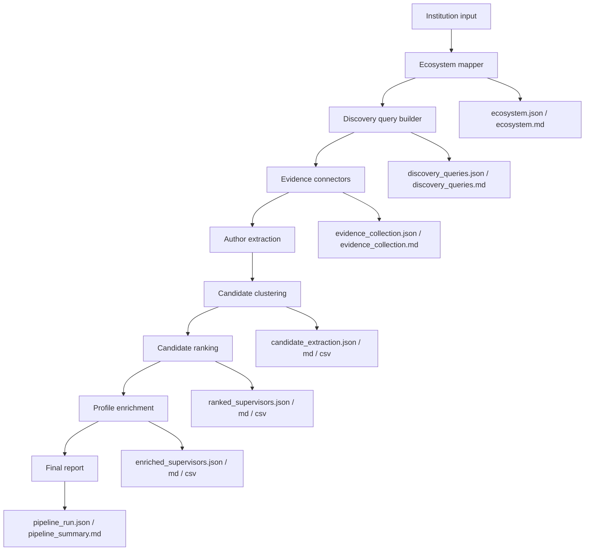

# Architecture

Postdoc Scout Agent is organized as a deterministic pipeline. Each stage produces files that can be reviewed, reused, and tested independently.

## Components

- `institution_mapper.py` maps a parent institution to relevant schools, hospitals, centers, and partner units.
- `query_builder.py` converts ecosystem units into source-specific discovery queries.
- `evidence_collector.py` runs scholarly source connectors and deduplicates publication evidence.
- `candidate_extractor.py` extracts author mentions and clusters repeated authors conservatively.
- `candidate_ranker.py` applies evidence-based scoring to preliminary candidate clusters.
- `candidate_enricher.py` adds optional funding, profile, and manual opening-signal evidence.
- `pipeline.py` orchestrates the full workflow and writes run-level reports.

## Design Principles

- Deterministic outputs before any LLM summarization.
- Explicit JSON/Markdown/CSV artifacts at every major boundary.
- Warnings instead of silent assumptions.
- Human review before outreach or claims about individual researchers.
- No scraping or external API use in tests.

